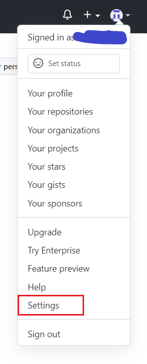
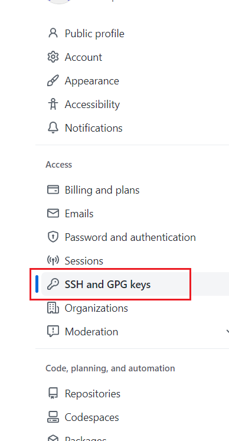
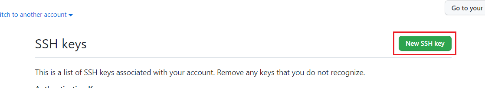
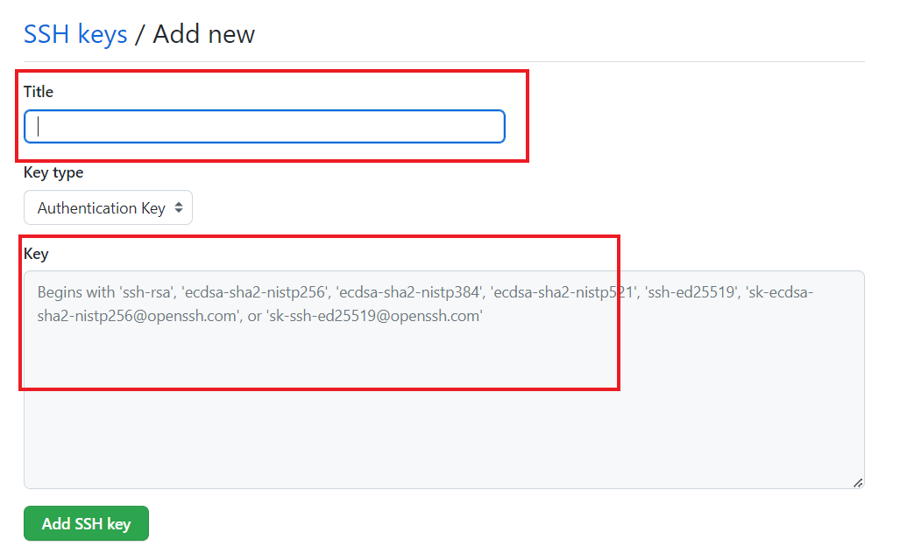

Windows配置sshkey方法使用git

先决条件：注册GitHub，并在本地安装Git


1. 安装Git, 打开git bash

```
ssh-keygen -t ed25519 -C your@email.com
```

your@email.com替换成GitHub上注册的邮件地址

2. 然后可以一路回车

```
lenovo@LAPTOP-R6CGCQJ8 MINGW64 /g/2023/tools/tools (master)
$ ssh-keygen -t ed25519 -C youremail.com
Generating public/private ed25519 key pair.
Enter file in which to save the key (/c/Users/xxx/.ssh/id_ed25519):
Enter passphrase (empty for no passphrase):
Enter same passphrase again:
Your identification has been saved in /c/Users/xxx/.ssh/id_ed25519.
Your public key has been saved in /c/Users/xxx/.ssh/id_ed25519.pub.
The key fingerprint is:
SHA256:XXXXXXXX your@email.com
The key's randomart image is:
+--[ED25519 256]--+X
XXXXXXxXXX
+----[SHA256]-----+

```

3. 将路径下的c：/Users/xxx/.ssh/id_ed25519.pub文件下的内容粘贴到Git上

打开Settings设置



点击Access下的“SSH and GPG keys"



在SSH keys的右侧点击“New SSH key”按钮




填入自定义title，然后将上一步骤中生成的id_ed25519.pub中的内容拷贝到Key中



点击Add SSH key，则添加ssh key成功


4. 本地打开git bash

```
$ ssh -T git@github.com
Hi XXX! You've successfully authenticated, but GitHub does not provide shell access.
```

如上图显示则表明已经配置成功