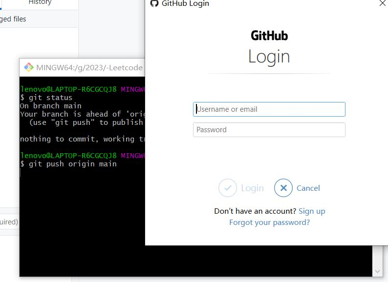

今天遇到一个问题

在之前新建的一个repo上更新时发现提交的时候弹窗让输入账号和密码，而且输入对了之后也不能提交代码




输入之后仍然报错


然后发现当前repository使用的是https而不是ssh，需要更新一下origin

于是执行以下操作：

```
git remote remove origin
git remote add origin git@github.com: YourUserName/Your_Repo_Name.git
```

之后再push就可以了


（其实按道理http输入密码之后也可以用，不知道为什么我这边出了问题，有待查证！）